# การทดลองที่ 10 Windows Form Application

# 1.	การทดลองย่อย เรื่อง Windows form

การทดลองย่อยนี้ จะช่วยให้นักศึกษา สามารถใช้งาน windows form ได้อย่างหลากหลายรูปแบบบ โดยการเรียนรู้ properties ต่างๆ ของ windows form ผ่านทางการโปรแกรมและการกำหนดด้วยคอนโทรลที่ชื่อ PropertyGrid Control

## การกำหนด Properties ของ Form และ Control
### ลำดับขั้นการทดลอง
1.	สร้าง Windows form application โดยตั้งชื่อเป็น Lab10_WindowsFormProperties
2.	รันโปรแกรม สังเกตุการทำงานและบันทึกผล
3.	แก้ไข property ของ Form1  โดยการเปลี่ยน Title เป็น “Form Properties”
4.	รันโปรแกรม สังเกตุการทำงานและบันทึกผล ว่าส่วนใดที่มีการเปลี่ยนแปลงไปบ้าง
เราจะเห็นว่า เมื่อสร้าง Form ขึ้นมาแล้ว เราสามารถเปลี่ยนแปลง Properties ต่างๆ ของฟอร์มได้โดยการสั่งด้วยโปรแกรม การเปลี่ยนค่าในตอนออกแบบ (Design time) หรือเปลี่ยนค่าขณะทำงาน (Run time)
5.	เพื่อเป็นการประหยัดเวลาในการทดลองปรับเปลี่ยน properties ให้ทำการเพิ่ม control ที่ชื่อ PropertyGrid ลงใน Form1
6.	ทำการเชื่อม PropertyGrid เข้ากับออปเจ็กต์ Form1 โดยเลือก SelectedObject ใน property ของ propertyGrid1 เป็น Form1
7.	รันโปรแกรมและทดลองเปลี่ยน Property ต่างๆ ของ Form1 และบันทึกผลการทดลอง

### คำถาม 

ถ้าต้องการเขียน code เพื่อกำหนดให้ Form1 มี property ดังต่อไปนี้ จะต้องเขียน code อย่างไร


## แบบฝึกหัด
1.	 จากการทดลอง สร้าง Windows Form Application สำหรับการ Login ที่มีคุณสมบัติต่อไปนี้


__หมายเหตุ__ Form height : 300,  Form width : 225 


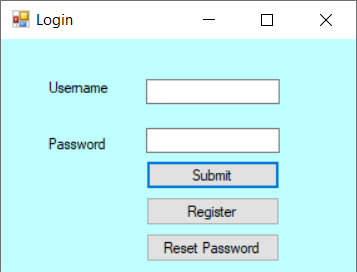

2. สร้างหน้าต่างสำหรับเครื่องโทรศัพท์ โดยกำหนดขนาดฟอนต์ Microsoft Sans Serif, 16pt


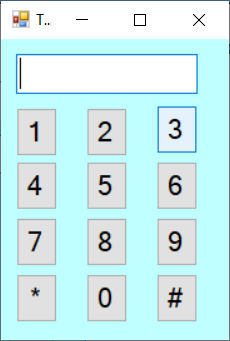


# 2.	การทดลองย่อยเรื่อง Control ชนิดต่างๆ  

## 2.1 การสร้างและใช้งาน control โดยการ Coding 

ขั้นตอนการทดลอง

2.1.1 สร้าง project ใหม่ โดยมีชนิดเป็น Windows Form App (.Net Framework)  ใช้ชื่อตามต้องการ (เช่น Lab10_ControlStudy) จะได้ solution ใหม่ที่มีหน้าต่าง window form ว่างเปล่า ดังรูป
 


2.1.2 เมื่อ IDE สร้าง solution  มาให้แล้ว ให้คลิกขวาที่ไฟล์ Form1.cs ใน Solution Explorer แล้วเลือกเมนู  “View Code” หรือกดคีย์ F7 เพื่อแก้ไข source code จะปรากฏหน้าต่าง Editor ดังรูป
   


2.1.3 การสร้างปุ่มบน window form

การสร้างปุ่มกด (button) บน window form เราจะเริ่มต้นโดยการสร้าง object จากคลาสที่ชื่อ Button จากนั้นจะกำหนด properties ต่างๆ ให้กับ button แล้วจึงผนวกเข้ากับ window form โดยเมธอด Controls.Add(...) ให้แก้ไข source code และรันโปรแกรมเพื่อสังเกตผลตามลำดับขั้นต่อไปนี้

* สร้าง reference ของปุ่มจากคลาส Button เพื่อให้เป็น reference แบบ global ซึ่งเข้าถึงได้ทกเมธอดในคลาส Form1 (บรรทัดที่ 15)
* สร้าง object จากคลาส Button แล้วเชื่อมโยงเข้ากับ reference ที่สร้างไว้ในบรรทัด 15 
* กำหนดจุดเริ่มต้นให้ ``btnHello`` โดยใช้คำสั่ง ```btnHello.Location  = new Point(20, 20);```
* กำหนดข้อความที่จะปรากฏบน ``btnHello`` โดยใช้คำสั่ง ```btnHello.Text  = “Hello”;```
* นำ ``btnHello`` ไปเพิ่มบน Form1 โดยคำสั่ง ```this.Controls.Add(btnHello);```


 
* รันโปรแกรมเพื่อดูผลการทำงาน

  * ทดลองกดปุ่ม Hello เพื่อดูว่าเกิดอะไรขึ้นบ้าง

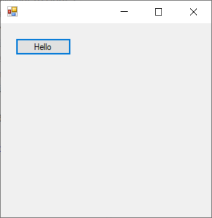


	
2.1.4 การเพิ่ม Event Handler ให้กับ control

Control ต่างๆ ที่เราได้สร้างขึ้นบน window form จะเป็นส่วนประกอบของ user interface จะต้องมีการเขียนโปรแกรมมารองรับ เพื่อให้ control เหล่านั้นตอบสนองต่อผู้ใช้ ใน .NET Framework จะมีกลไกในการทำงานของ control ต่างๆ ผ่านฟังก์ชันพิเศษที่เรียกว่า Event handler (ฟังก์ชันรองรับเหตุการณ์ของ control) ที่เป็นเช่นนี้ ก็เพื่อเป็นการส่งคำสั่งไปยังฟังก์ชันที่เขียนขึ้นมาเพื่อตอบสนองต่อเหตุการณ์นั้นๆ และไม่ทำให้ส่วนติดต่อผู้ใช้เกิดการสะดุด หรือหยุดชะงักในกรณีที่เหตุการณ์นั้นๆ ต้องใช้เวลาทำงานยาวนาน เช่นการพิมพ์งานออกทาง printer หรือการดึงข้อมูลจากอินเตอร์เน็ตเป็นต้น
	
* เพิ่ม Event Handler เพื่อให้ปุ่มกด btnHello รองรับเหตุการณ์ Click ให้พิมพ์ ``btnHello.Click += BtnHello_Click;`` (บรรทัดที่ 15) จะสังเกตุว่า เมื่อพิมพ์มาถึงเครื่องหมาย =  นั้น IDE จะเสนอความช่วยเหลือในการเขียน code ถ้าต้องการยอมรับข้อเสนอดังกล่าว ให้กดปุ่ม Tab (บรรทัดที่ 15)

* ในเมธอด ``BtnHello_Click(object sender, EventArgs e)`` ให้เพิ่ม code สำหรับแสดง message box  ``MessageBox.Show("Hello");`` 

* โปรแกรมที่เสร็จแล้วจะมีลักษณะดังรูปต่อไปนี้
 


ตัวอย่างการใช้งาน Event Handler เพื่อเปลี่ยนสีพื้นหลังของปุ่มกด เมื่อนำเมาส์ไปอยู่เหนือปุ่มกด (mouse hover)

1.	เพิ่ม Event Handler สำหรับ Mouse Enter
2.	เพิ่ม Event Handler สำหรับ Mouse Leave
3.	เพิ่มตัวแปร Color btnBackColor เพื่ิอเก็บค่าดั้งเดิมของสีพื้นหลังปุ่มกด
 


 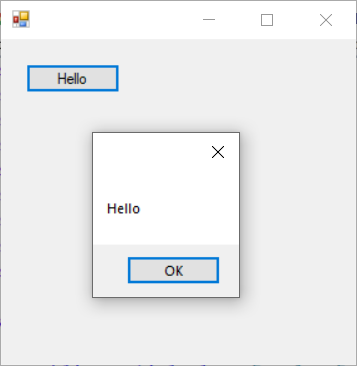

## 2.2 การสร้างและใช้งาน control โดยการใช้ Visual Editor

Visual studio ได้จัดเตรียม control พื้นฐานต่างๆ ไว้ให้นักพัฒนาโปรแกรมได้เลือกใช้ โดยที่ control ต่างๆ เหล่านี้จะมีทั้ง control ที่มีส่วนติดต่อผู้ใช้ เช่น Button, TextBox เป็นต้น  control ที่ไม่มีส่วนติดต่อผู้ใช้ เช่น Timer, Serial Port เป็นต้น และ control ที่เป็น Dialog box ต่างๆ การสร้างความคุ้นเคยกับ control ต่างๆ จะทำให้นักพัฒนาโปรแกรมมีศักยภาพในการพัฒนาโปรแกรมได้มากขึ้น เนื่องจาก control ต่างๆ เหล่านั้น ผ่านการออกแบบ ทดสอบและแก้ไขข้อบกพร่องต่างๆ มาเป็นระยะเวลายาวนาน และโดยนักพัฒนาจำนวนมากได้ป้อนกลับข้อผิดพลาดไปยังนักออกแบบ control เหล่านั้น

อย่างไรก็ตาม นอกเหนือจาก control ที่มากับชุดพัฒนา IDE เรายังสามารถสร้าง control ได้เองไม่จำกัด เรียกว่า custom control หรือ user control แต่จะอยู่นอกเหนือการทดลองในวิชานี้ 

รูปต่อไปนี้แสดง control ส่วนใหญ่ที่พบใน Visual studio ซึ่งสามารถเรียกได้จากเมนู View->Toolbox และหน้าต่าง editor จะต้องเปิด window form ในฐานะ Design view ด้วย (จะไม่ปรากฏ control ต่างๆ ใน toolbox  ถ้าหน้าต่าง editor อยู่ใน text mode หรือโหมดอื่นๆ ที่ไม่ใช่ [Design])
 	 	 

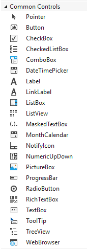


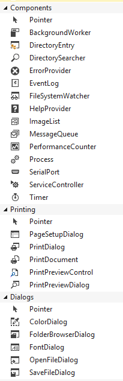


### 2.2.1 การสร้างโปรแกรมบวกเลข 2 จำนวน โดยใช้ control ต่างๆ บน window form

__ขั้นตอนการทดลอง__

* สร้าง Solution ใหม่ ชื่อ SumTwoNumbers
* เปลี่ยนชื่อไฟล์ Form1.cs เป็น SumTwoNumbers.cs ถ้ามี dialog box ขึ้นมาถามให้เปลี่ยน code ทั้งหมดเป็น SumTwoNumbers ให้ตอบ Yes
* เปลี่ยนชื่อ window form เป็น “Sum Two Numbers”
* เพิ่ม Label บน window form ให้ชื่อว่า firstNumberLabel และให้ caption เป็น “First Number”  
* เพิ่ม Label บน window form ให้ชื่อว่า secondNumberLabel และให้ caption เป็น “Second Number”  
* เพิ่ม TextBox บน window form ให้ชื่อว่า firstNumberTextBox และให้ caption เป็น ว่างเปล่า  วางไว้ที่ด้านขวามือของ firstNumberLabel
* เพิ่ม TextBox บน window form ให้ชื่อว่า secondNumberTextBox และให้ caption เป็น ว่างเปล่า วางไว้ที่ด้านขวามือของ secondNumberLabel
* เพิ่ม Label บน window form ให้ชื่อว่า sumLabel และให้เปลี่ยนค่าใน Text Property  เป็น “Sum :”
* เพิ่มปุ่ม Button บน window form ให้ชื่อว่า calculateButton  และให้ caption เป็น “Calculate Sum” ปรับขนาดปุ่มให้พอดีกับการแสดงข้อความ
* ดับเบิลคลิก ที่ปุ่ม เพื่อให้ IDE ทำการเพิ่ม Event handler ให้กับปุ่ม
* เพิ่ม Code ต่อไปนี้ให้กัับ event handler ของปุ่มกด


รันโปรแกรมและทดลองป้อนตัวเลขลงใน ``firstNumberTextBox`` และ ``secondNumberTextBox`` 

* ถ้าใส่ตัวอักษรลงไป จะเกิดอะไรขึ้น เมื่อกดปุ่ม ``calculateButton`` ถ้ามีปัญหา (Exception) จะแก้ไขได้อย่างไร
	
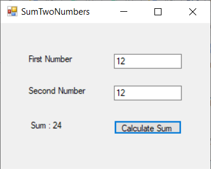

# 3. การทดลองย่อย เรื่อง Dialog Boxes สำเร็จรูปชนิดต่างๆ

## 3.1 FolderBrowserDialog

เพื่อที่จะศึกษาถึงรายละเอียดต่างๆ ของ FolderBrowserDialog เราสามารถศึกษาได้โดยการใช้ PropertyGrid Control เช่นเดียวกับในการทดลองก่อนหน้านี้

* สร้าง Application ใหม่ ชื่อ folderBrowser โดยให้มีหน้าจอและองค์ประกอบดังต่อไปนี้
 
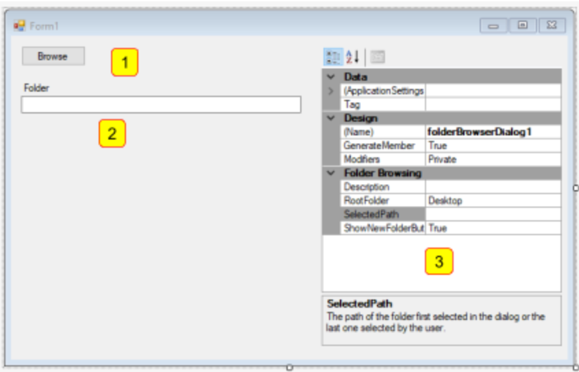


 
สังเกตว่า ``folderBrowserDialog1`` จะไม่มี user intarface บน window form เนื่องจากมันมีลักษณะเป็น Dialog box control แต่มันจะถูกนำไปวางไว้ใต้ window form ดังรูป


* ดับเบิลคลิกที่ปุ่ม btnFolderBrowser เพื่อให้ IDE ทำการสร้าง event handler ให้ จะได้  event handler ที่ชื่อ private void btnFolderBrowser_Click(object sender, EventArgs e) ให้แก้ไข code เป็นดังต่อไปนี้


 

* รันโปรแกรมและคลิกปุ่ม Browse  และเลือก folder ที่ต้องการ 
* ใน propertyGrid1 ให้เปลี่ยน RootFolder เป็นค่าอื่นๆ แล้วกด Browse บันทึกผลที่ได้
* เปลี่ยน ShowNewFolderButton จาก True เป็น False และกดปุ่ม Browse สังเกตุความแตกต่าง และบันทึกผล

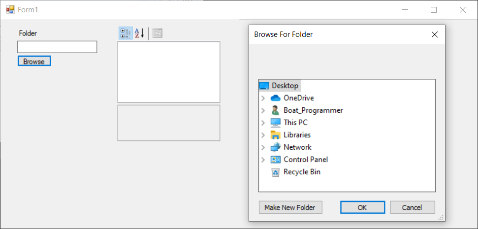


## 3.2 OpenFileDialog

* สร้าง Application ใหม่ ชื่อ openFileDialog โดยให้มีหน้าจอและองค์ประกอบดังต่อไปนี้
 
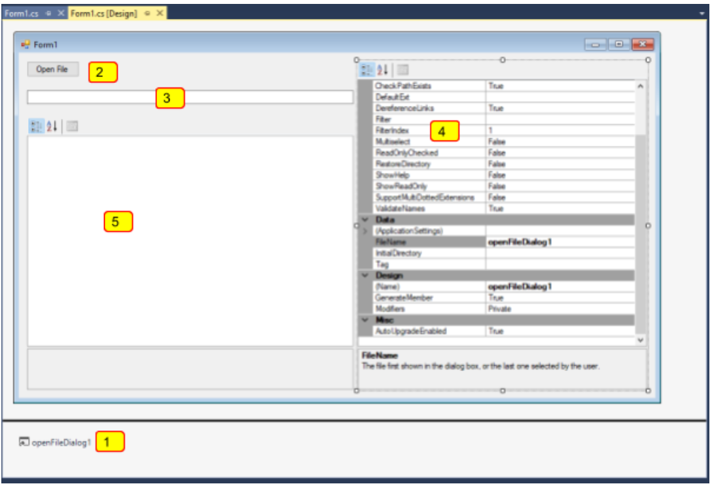
 


* ดับเบิลคลิกที่ปุ่ม btnOpenFile เพื่อให้ IDE ทำการสร้าง event handler ให้ จะได้  event handler ที่ชื่อ  private void btnOpenFile_Click(object sender, EventArgs e) ให้แก้ไข code เป็นดังต่อไปนี้


* รันโปรแกรมและคลิกปุ่ม Browse เลือก folder และ file ที่ต้องการ 
* สังเกตุและบันทึกผลการทดลอง
* ลองเลือกไฟล์อื่นๆ สังเกตการเปลี่ยนแปลง

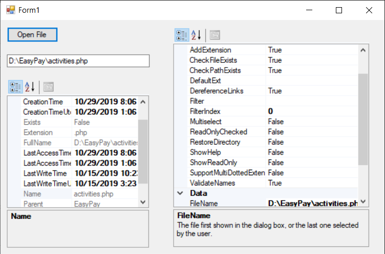


 
## 3.3 ColorDialog
* สร้าง Application ใหม่ ชื่อ colorDialog โดยให้มีหน้าจอและองค์ประกอบดังต่อไปนี้
 


* ดับเบิลคลิกที่ปุ่ม btnColorDialog เพื่อให้ IDE ทำการสร้าง event handler ให้ จะได้  event handler ที่ชื่อ  private void btnColorDialog_Click(object sender, EventArgs e) ให้แก้ไข code เป็นดังต่อไปนี้


* รันโปรแกรมและคลิกปุ่ม Color Dialog เพื่อเลือกสีที่ต้องการ 
* สังเกตุและบันทึกผลการทดลอง
* ลองเลือกสีอื่นๆ สังเกตการเปลี่ยนแปลง

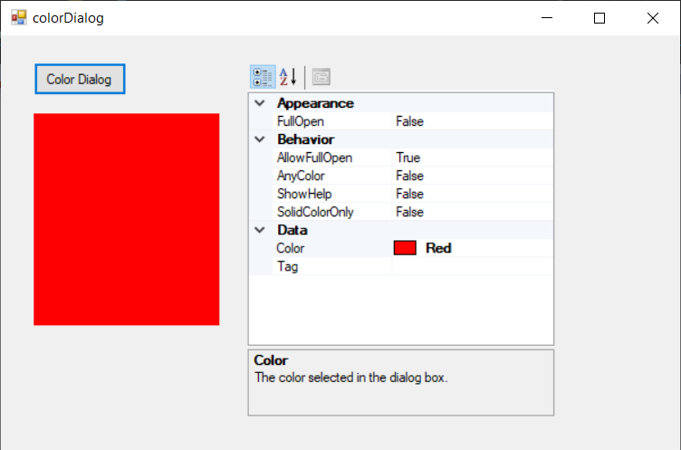

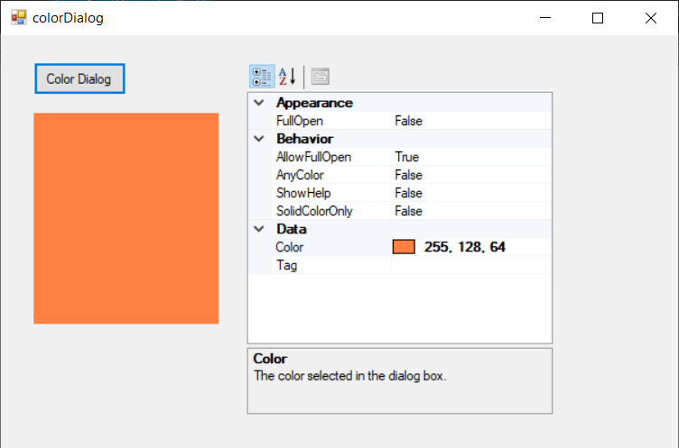

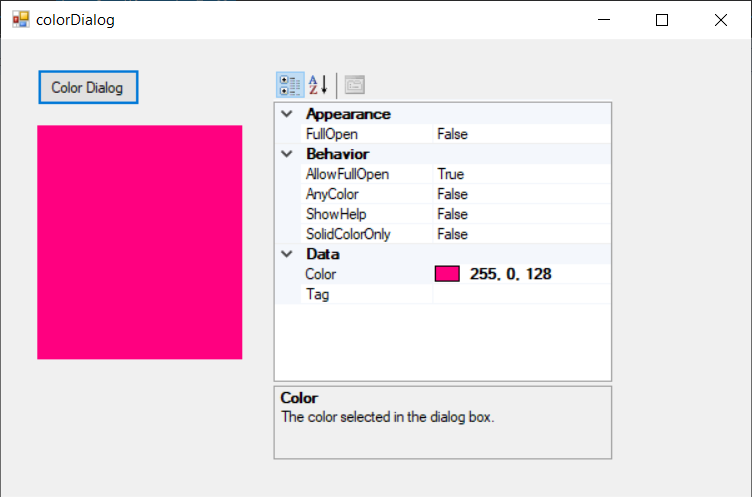

## 3.4 FontDilalog
* สร้าง Application ใหม่ ชื่อ colorDialog โดยให้มีหน้าจอและองค์ประกอบดังต่อไปนี้
 


* ดับเบิลคลิกที่ปุ่ม btnFontDialog เพื่อให้ IDE ทำการสร้าง event handler ให้ จะได้  event handler ที่ชื่อ  private void btnFontDialog_Click(object sender, EventArgs e) ให้แก้ไข code เป็นดังต่อไปนี้


* ดับเบิลคลิกที่ปุ่ม btnUpdateRichTextBox1 เพื่อให้ IDE ทำการสร้าง event handler ให้ จะได้   private void btnUpdateRichTextBox1_Click(object sender, EventArgs e) ให้แก้ไข code เป็นดังต่อไปนี้


* รันโปรแกรมและคลิกปุ่ม Font Dialog เพื่อเลือก font ที่ต้องการ 
* สังเกตุและบันทึกผลการทดลอง
* ลองเลือก font อื่นๆ สังเกตการเปลี่ยนแปลง
* เปลี่ยนแปลงข้อความใน textBox1 แล้วกดปุ่ม Update text

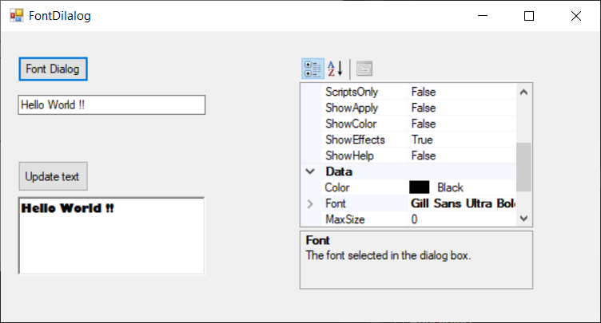

 
## 2.5 SaveFileDialog Control

* สร้าง Application ใหม่ ชื่อ saveFileDialog โดยให้มีหน้าจอและองค์ประกอบดังต่อไปนี้


* ดับเบิลคลิกที่ปุ่ม btnSaveToFile เพื่อให้ IDE ทำการสร้าง event handler ให้ จะได้  event handler ที่ชื่อ  private void btnSaveToFile_Click(object sender, EventArgs e) ให้แก้ไข code เป็นดังต่อไปนี้


* รันโปรแกรม
* แก้ไขข้อความใน textBox1
* คลิกปุ่ม Save to file จากนั้นให้เลือกที่ตั้งและชื่อไฟล์ตามต้องการ
* สังเกตุและบันทึกผลการทดลอง
* เปิดไฟล์ที่บันทึกไว้เพื่อดูข้อมูล ว่าตรงตามที่เขียนใน textBox1 หรือไม่
* เปลี่ยนแปลงข้อความใน textBox1 แล้วทดลองบันทึกเป็นชื่อไฟล์ และ/หรือ เปลี่ยนตำแหน่งที่ตั้งเป็นที่อื่นๆ  บันทึกผลการทดลอง

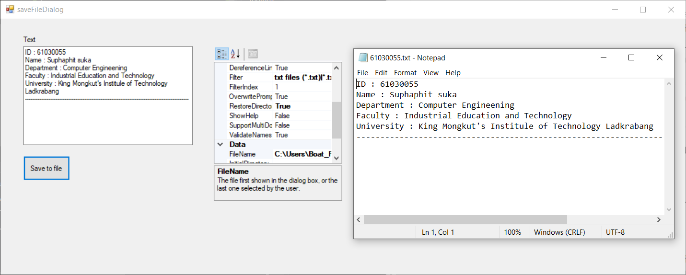


